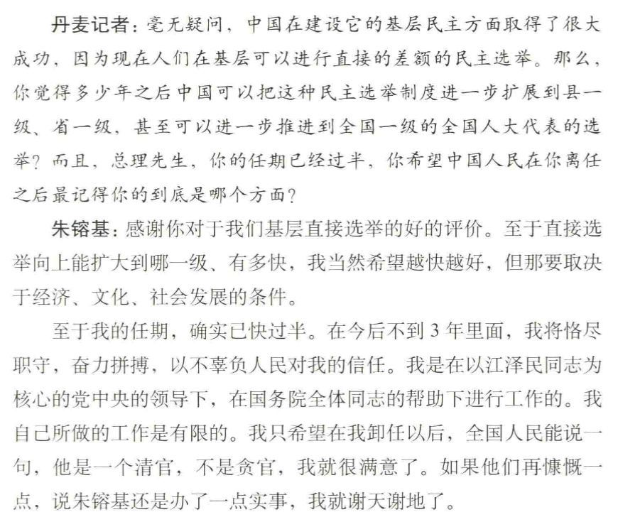

最近一直在读朱镕基总理的书，讲话实录四卷加上答记者问一本，一共五本书，都是人民出版社的。

从80年代中期开始，朱就一直主管经济，90年代随着江的新一代领导核心登台，成了经济领域的主管副总理，是中国经济名副其实的一把手。讲话实录4卷基本都是官方性质的文件、批示，但是很意外的读起来和读八股完全不一样，基本全是实务方面的内容，比如《关于实施分税制问题致江泽民、李鹏同志并中共中央政治局常委的信》、《平抑粮油价格、稳定市场供应》，读起来完全不晦涩，见不到什么弯弯绕绕，朱的风格就是干练精简，直击标的，比如

四卷读了半个月，从92年读到03年，像是一场经济学实务和技术官僚的培训课，真的是非常有意思的体验。

但其实最想聊的是《朱镕基答记者问》这一本书，482页三天就读完了，从九届人大记者会，到访美访日接受外国媒体的采访。能感觉到的是，在外国媒体的采访中的即席采访里，朱镕基那种仿佛希腊雄辩家一样的风格体现的更突出，从经济改革聊到台湾问题，从政治风波聊到人权问题，落落大方不偏不倚。

我简单摘取一些不那么“官方”的访谈内容，这也是我最喜欢的部分。

当韩国中央日报社社长洪锡炫问道对年轻人的寄语时

实际上朱的父亲在他出生前就去世了，母亲也在他12岁时因病过世

日本NHK主持人国谷裕子问那20年的坎坷时

1958年反右风波中，从清华毕业后在国家计划委员会工作7年的朱镕基被打倒，下放劳动开除党籍。

两年后恢复部分工作，又作为一个普通工程师工作了10年，1970年去了湖北襄樊的集体农场劳动改造，种棉花养猪放羊，一去就是5年。

印度记者问道他的私人生活时，他说

当美国记者问道

当丹麦记者问到希望中国人民记得什么时，他说

当聊到地雷阵时，他说

当然采访中，提到最多的还是经济相关的话题，但是反而是这些没有那么正式没有那么“商务”的回答，我读的饶有兴趣。

随笔写到这里读后感的部分就写完了，还有一些最近的内心波动，随便聊聊。

shox那张抽烟的截图我一直存着

最后一舞，不甘和遗憾，傍晚的路灯。

70年代的国际俱乐部舞会上，十六岁的韩秀和周恩来总理跳着慢四步，她问周，您觉得谢伟思，安娜.路易斯.斯特朗他们这些人怎么样？周总理想了一会，很认真的和小朋友说:“他们是软弱的。”

是软弱的，这一句话我记了好久，很奇怪的。韩秀的回忆录里关于老舍、赵芸如的爱恨情仇、她的身世浮萍很多都记不确切了，但是周的这一句话一直没有忘记，像是电影的封面一样，瞬间就闪回。

小时候和妈妈一起看周星驰的唐伯虎点秋香，妈妈说做人要学小强，做怎么都踩不死的蟑螂。妈妈16岁就一个人从安庆去了杭州打工，吃了很多苦，父亲也是一样，18岁没有考上大学，就去了紫阳饭店烧锅炉。

身边的年轻人谈不上都很辛苦，但是大家都有自己的困难。要挣钱要努力工作，要把握机会要抓住风口，要提升能力要早点结婚，要提升学历要经济独立。很多问题又不一定有解析解，很多心事也不一定说的出表达的好。深圳的天气不好，要么就一直下雨，要么就热的要死，地铁挤得要死，上周打球还把脚扭了。

不知道怎么结尾了，还是用朱镕基的回答来结尾吧。

这些问题也是会过去的。