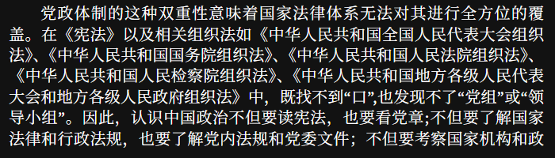
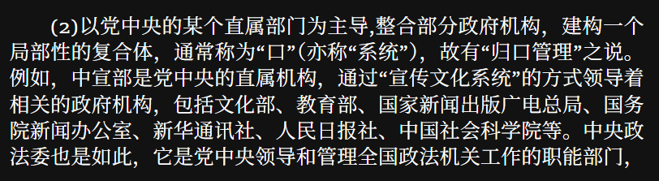
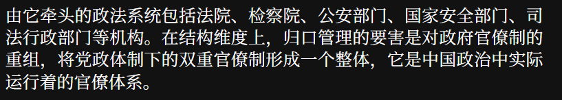
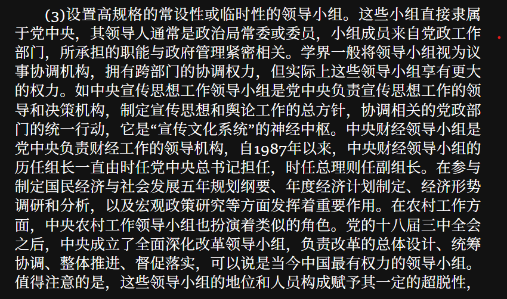
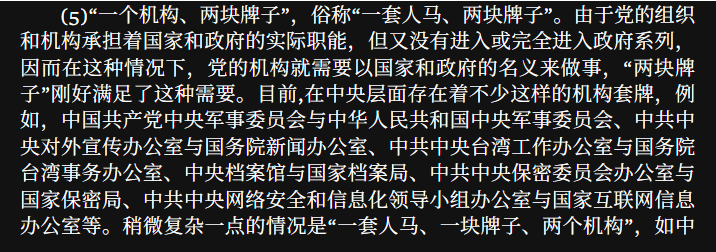
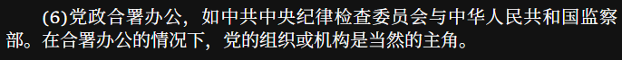
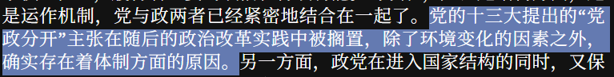
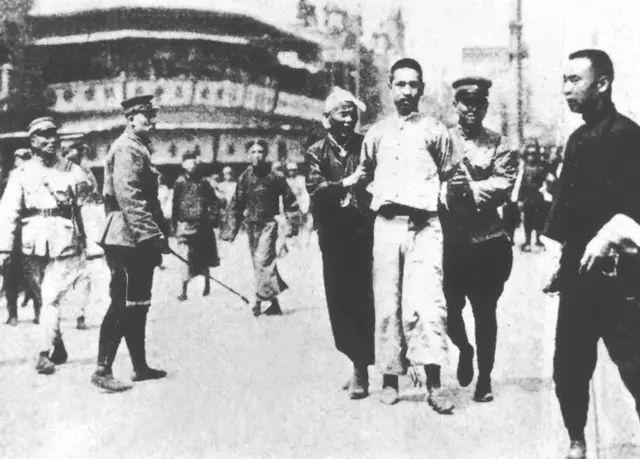

花了一周时间看完了《当代中国政府与政治》，作者是景跃进、陈明明、肖滨，分别是清华、复旦和中山的政治学系副主任、政治学系主任以及公共事务管理学院院长。

书是教科书，具体是政治学系还是什么系的我就不清楚了，没有具体去了解。作为门外汉看这本书本身也是抱着不求甚解的态度，很多车轱辘话和党八股我都是跳过的。

我觉得书比较好的地方在于对于一些真正存在的现象，没有抱着马虎眼的态度来处理，比如在聊到很核心的党政体制时，书中比较直白的说了"无法进行全方位的覆盖"

有一些内容，比如“口”这样一个概念的说明，讲的也是非常明了

还有就是新闻上经常看到的xx领导小组

包括“一个机构，两块牌子”的情况

还有“党政合署办公”的概念，这个我还真的完全不知道

书的中后部分我觉得是更精华的地方，包括了中央人民政府的职能划分、运行决策过程；政法系统、宣传系统的介绍；央地关系、地方政府的解释等等，很多的概念对于我本人来讲肯定是学习到了。当然相对来讲，我在看历史沿革的时候是更感兴趣，毕竟我也不是公务员也不是政治学的学生，普通人可能对于改革开放后，整体行政架构的变迁等等更有兴趣。比如

读到这里，对于历史有了解的朋友都会会心一笑，包括了赵紫阳、政治改革领导小组以及之后的事情等等。总之我想说的是这本书抛去我确实不感兴趣的特定内容外，很多实务的东西讲的还是很好的，对于我来说是类似于科普性质的东西，读到还是会有豁然开朗的感觉，以后和公务员朋友吹牛逼也有话说，哈哈。

书的介绍就说到这里，抛砖引玉想聊书中的一个很有趣的观点。当然这个观点是我修饰了一下的，中国与当前世界许多国家政治上的泾渭之别在于哪里，与大多数人想的“代议制民主”、“直选式投票”、“三权分立”等等可能不太一样。核心的区别在于————党政体制。书中这样说道：“第一，在当代中国的政治制度设置中，它是一个长期执政的党，其他民主党派是参政党，不存在轮流执政的问题；第二，与长期执政相联系，中国共产党本身已成为一个嵌入政治结构的等级组织，具有与国家机构相对应的科层制结构。”

嵌入这个词用的真好，CCP和很多其他国家执政党不同的地方是什么，从1921年创立，经历了四一二反革命政变、长征、抗日战争...四一二的史料推荐大家阅读，真的是非常残酷和血腥，几十万左派被处决。

从一大到建国，没有剩下几个同志了。这是一个革命党，不是1848年欧洲光荣革命，不是议会斗争，不是游行示威，是最残忍最冰冷的内部斗争中，从累累白骨中踏出来的。

1936年西班牙内战中，为什么左派失败了，根本原因就是这支左派是软弱的（可以看看早期的周的照片，如磐石般坚毅的精神的映照），缺乏严密的不讲人情的控制一切的无比强烈的政治组织度。这也是CCP在20年的恐怖斗争里活到最后的原因。

这也适用于今天的中国，极其强大的组织度，对于宣传系统的高度重视，对于行政系统的嵌入等等，你是能看到一个一致性的。党政一体是今天的中国和大多数国家政治体系不同的核心。没有后退，没有第二选项，No Step back,如邓小平同志面对风波时说的，“一步也不能退”。

超高的政治组织度，绝对的党的意志和国家意志，对于执政目标没有任何疑问的坚决执行，这当然是党政一体的优点，在八九十年代的诸多改革中也可以看到端倪，伴随着巧妙地政治架构的组建，比如中顾委。这些帮助中国走过了改革开放的三十年。

（后面写了一些没办法发出来，就删了）